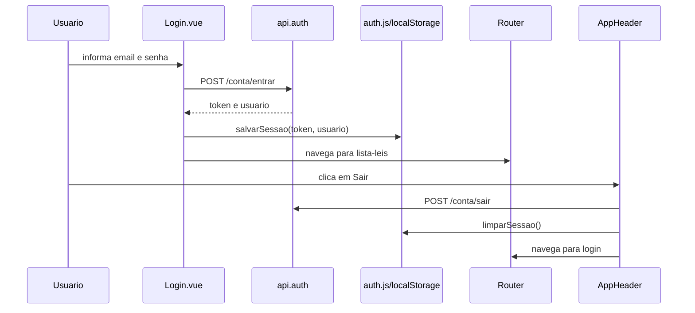
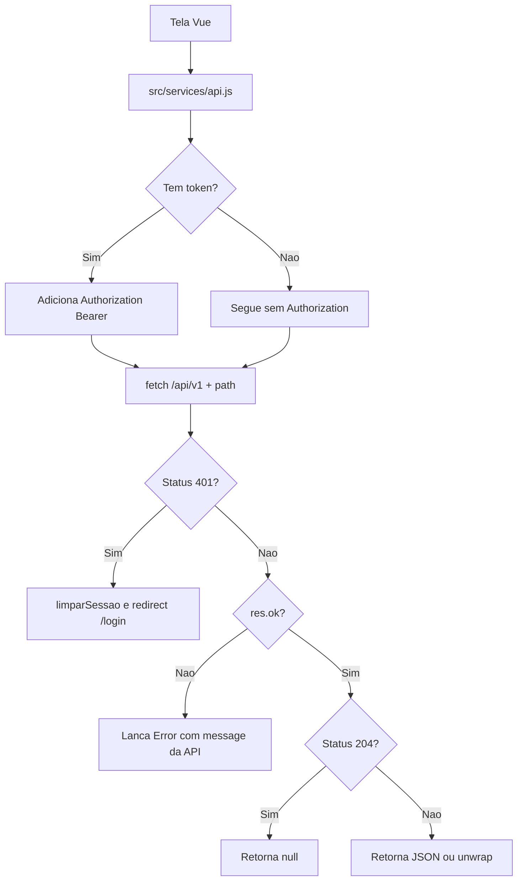
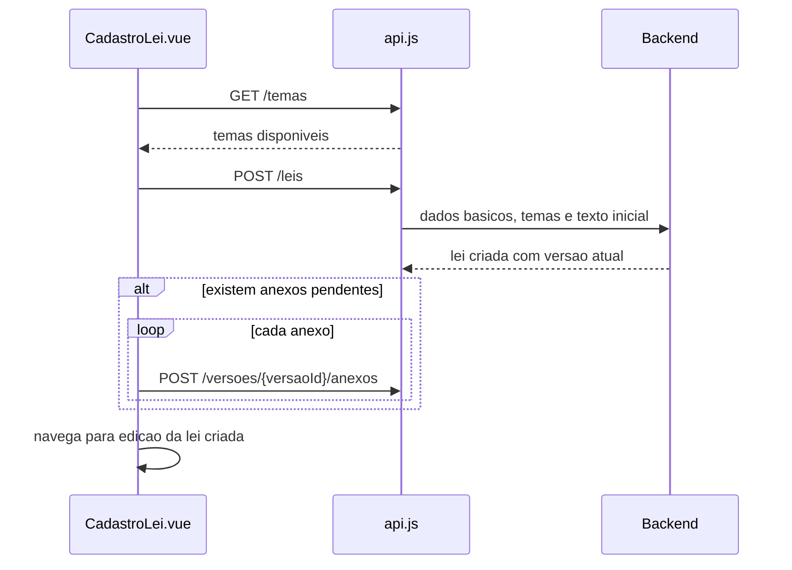
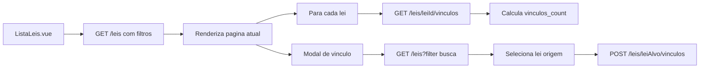
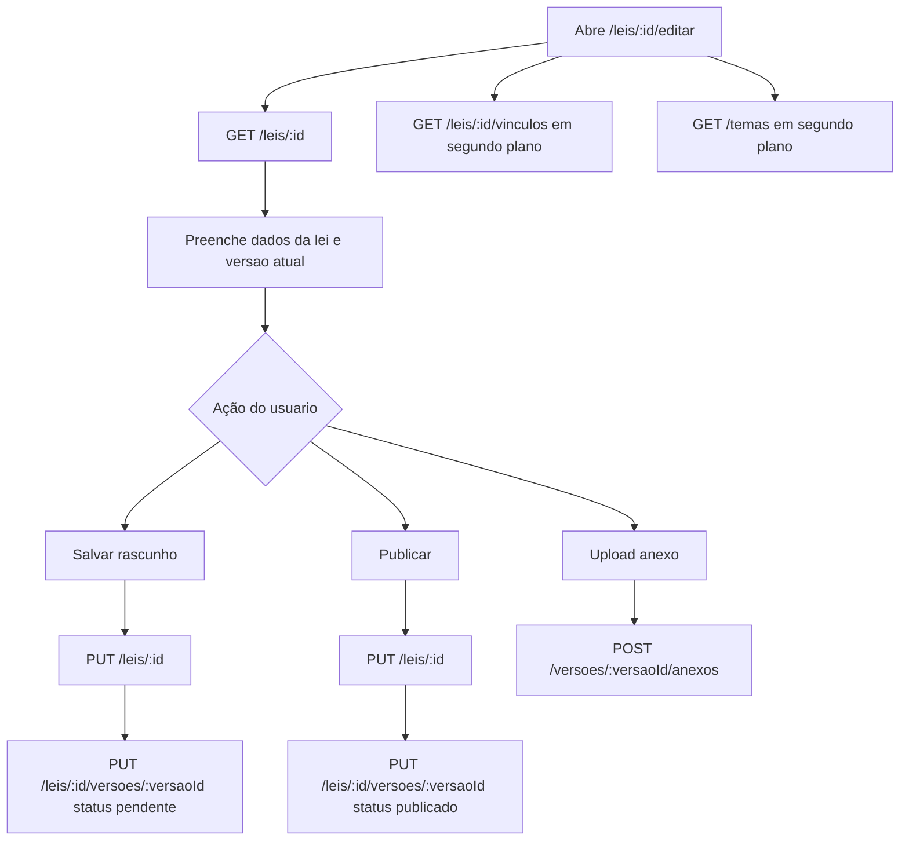
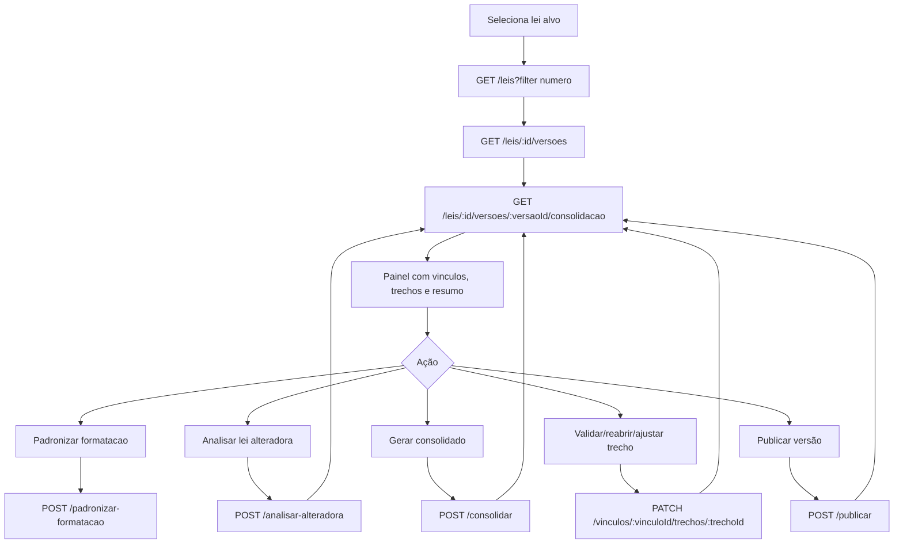
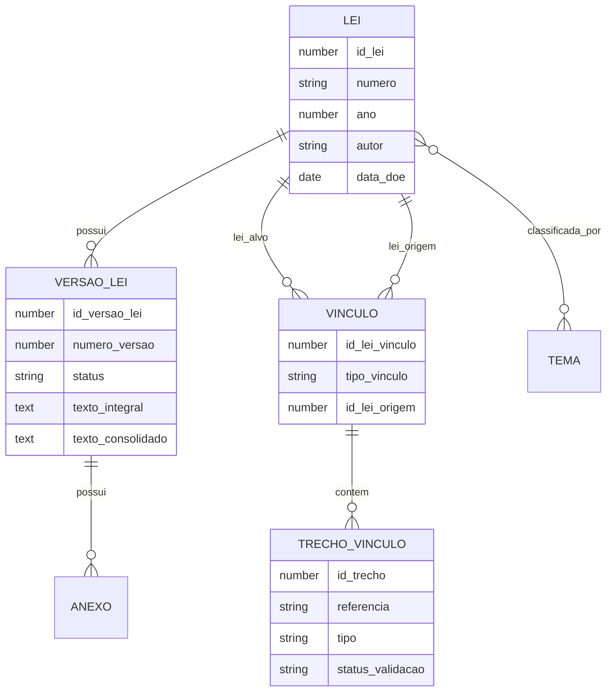

# Front Legislativo

Interface web para gestão de atos normativos da Assembleia Legislativa do Ceará. O projeto permite autenticar usuários, consultar leis, cadastrar e editar versões, anexar documentos, registrar vínculos entre normas e conduzir o fluxo de consolidação legislativa.

## Tecnologias

- **Vue 3**: framework principal da aplicação.
- **Vite 6**: servidor de desenvolvimento, build e proxy para a API.
- **Vue Router 4**: rotas SPA e proteção de telas autenticadas.
- **Tailwind CSS 3**: utilitários de estilo.
- **TipTap 3 / ProseMirror**: editor rico usado nos textos legislativos.
- **Fetch API**: comunicação HTTP centralizada em `src/services/api.js`.
- **LocalStorage**: persistência local do token e do usuário autenticado.

## Requisitos

- Node.js compatível com Vite 6.
- npm.
- Acesso ao backend da API legislativa.

## Como Executar

Instale as dependências:

```bash
npm install
```

Execute em desenvolvimento:

```bash
npm run dev
```

Gere build de produção:

```bash
npm run build
```

Pré-visualize o build:

```bash
npm run preview
```

Por padrão, o Vite sobe em `http://localhost:5173`.

## Configuração da API

A aplicação chama a API sempre pelo prefixo local:

```js
const BASE_URL = '/api/v1'
```

Durante o desenvolvimento, o Vite faz proxy de `/api` para o backend configurado em `vite.config.js`:

```js
proxy: {
  '/api': {
    target: 'https://api.legislativo.fixtecnologia.com.br',
    changeOrigin: true,
  },
}
```

Assim, uma chamada do front para `/api/v1/leis` é encaminhada pelo Vite para o backend remoto.

## Scripts

| Script | Descrição |
| --- | --- |
| `npm run dev` | Inicia o servidor Vite em modo desenvolvimento. |
| `npm run build` | Compila a aplicação para a pasta `dist/`. |
| `npm run preview` | Serve localmente o build gerado. |

## Estrutura do Projeto

```text
.
├── index.html
├── package.json
├── vite.config.js
├── tailwind.config.js
├── postcss.config.js
└── src
    ├── App.vue
    ├── main.js
    ├── style.css
    ├── components
    │   ├── AppHeader.vue
    │   └── EditorTexto.vue
    ├── router
    │   └── index.js
    ├── services
    │   ├── api.js
    │   └── auth.js
    └── views
        ├── Login.vue
        ├── ListaLeis.vue
        ├── CadastroLei.vue
        ├── DetalheLei.vue
        ├── EdicaoLei.vue
        ├── ConsolidacaoLegislativa.vue
        └── ConsolidacaoLei.vue
```

### Principais Módulos

| Caminho | Função |
| --- | --- |
| `src/main.js` | Cria a aplicação Vue, registra o router e monta em `#app`. |
| `src/App.vue` | Renderiza a rota ativa com `RouterView`. |
| `src/router/index.js` | Define rotas e protege telas que exigem autenticação. |
| `src/services/auth.js` | Gerencia token, usuário, login persistido e limpeza de sessão. |
| `src/services/api.js` | Centraliza endpoints, tratamento de erro, autorização e unwrap de recursos Laravel. |
| `src/components/AppHeader.vue` | Cabeçalho, navegação principal e logout. |
| `src/components/EditorTexto.vue` | Editor rico TipTap para textos legislativos. |
| `src/views/*.vue` | Telas de login, listagem, cadastro, edição, detalhe e consolidação. |

`ConsolidacaoLei.vue` existe no código, mas a rota ativa de consolidação aponta para `ConsolidacaoLegislativa.vue`.

## Rotas da Aplicação

| Rota | Nome | Tela | Acesso |
| --- | --- | --- | --- |
| `/login` | `login` | `Login.vue` | Público |
| `/` | `lista-leis` | `ListaLeis.vue` | Autenticado |
| `/leis/novo` | `cadastro-lei` | `CadastroLei.vue` | Autenticado |
| `/leis/:id` | `detalhe-lei` | `DetalheLei.vue` | Autenticado |
| `/leis/:id/editar` | `edicao-lei` | `EdicaoLei.vue` | Autenticado |
| `/consolidacao` | `consolidacao-lei` | `ConsolidacaoLegislativa.vue` | Autenticado |

O guard global do router redireciona usuários sem token para `/login?redirect=<rota>`. Usuários autenticados que acessam `/login` são enviados para a listagem.

## Fluxo de Autenticação



Todas as requisições autenticadas enviam `Authorization: Bearer <token>`. Se a API retornar `401`, `api.js` limpa a sessão, redireciona para `/login` e lança erro de sessão expirada.

## Comunicação com a API

O serviço `request(path, options)` em `src/services/api.js` aplica a lógica comum:

1. Monta headers com `Accept: application/json`.
2. Inclui `Authorization` quando existe token.
3. Executa `fetch(BASE_URL + path)`.
4. Em `401`, limpa a sessão e redireciona para login.
5. Em erro HTTP, tenta ler `message` do JSON de resposta.
6. Em `204`, retorna `null`.
7. Nos demais casos, retorna JSON.

Recursos individuais da API Laravel podem vir embrulhados em `{ data: ... }`. A função `unwrap` remove esse envelope quando presente.



## Endpoints Usados

Todos os caminhos abaixo são relativos ao prefixo `/api/v1`.

### Autenticação

| Método | Endpoint | Uso no front | Lógica |
| --- | --- | --- | --- |
| `POST` | `/conta/entrar` | `Login.vue` | Envia `email` e `senha`; espera `token` e `usuario`; salva sessão local. |
| `POST` | `/conta/sair` | `AppHeader.vue` | Solicita logout no backend; mesmo em erro, a sessão local é limpa. |
| `GET` | `/conta/perfil` | `api.auth.me()` | Disponível no serviço para buscar perfil autenticado. |

### Leis

| Método | Endpoint | Uso no front | Lógica |
| --- | --- | --- | --- |
| `GET` | `/leis` | `ListaLeis.vue`, `EdicaoLei.vue`, `ConsolidacaoLegislativa.vue`, `ConsolidacaoLei.vue` | Lista leis com paginação e filtros. Usa parâmetros como `page`, `per_page`, `filter[numero]`, `filter[ementa]`, `filter[data_inicio]`, `filter[data_fim]` e `filter[busca]`. |
| `GET` | `/leis/{id}` | `DetalheLei.vue`, `EdicaoLei.vue`, modais de vínculo | Busca os dados completos de uma lei, incluindo tipo, temas e versão atual quando retornados pela API. |
| `POST` | `/leis` | `CadastroLei.vue` | Cria uma lei com metadados, temas e conteúdo inicial. Depois do cadastro, a tela pode enviar anexos para a versão criada. |
| `PUT` | `/leis/{id}` | `EdicaoLei.vue` | Atualiza metadados da lei: tipo, número, ano, autor, data DOE e temas. |
| `DELETE` | `/leis/{id}` | `api.leis.remover()` | Disponível no serviço para remover uma lei. |

### Versões de Lei

| Método | Endpoint | Uso no front | Lógica |
| --- | --- | --- | --- |
| `GET` | `/leis/{id}/versoes` | `DetalheLei.vue`, `EdicaoLei.vue`, `ConsolidacaoLegislativa.vue`, `ConsolidacaoLei.vue` | Carrega histórico de versões e seleciona a versão atual quando `versao_atual` está marcado. |
| `GET` | `/leis/{leiId}/versoes/{versaoId}` | `api.leis.versao()` | Disponível para buscar uma versão específica. |
| `POST` | `/leis/{leiId}/versoes` | `api.leis.criarVersao()` | Disponível para criar nova versão de uma lei. |
| `PUT` | `/leis/{leiId}/versoes/{versaoId}` | `EdicaoLei.vue` | Atualiza ementa, textos, datas, notas e status da versão. |
| `POST` | `/leis/{leiId}/versoes/{versaoId}/publicar` | `ConsolidacaoLegislativa.vue` | Publica a versão selecionada após revisão/consolidação. |
| `POST` | `/leis/{leiId}/versoes/{versaoId}/padronizar-formatacao` | `ConsolidacaoLegislativa.vue` | Solicita padronização do campo textual atual: `texto_integral` ou `texto_consolidado`. |

### Consolidação Legislativa

| Método | Endpoint | Uso no front | Lógica |
| --- | --- | --- | --- |
| `GET` | `/leis/{leiId}/versoes/{versaoId}/consolidacao` | `ConsolidacaoLegislativa.vue` | Carrega painel de consolidação, resumo, vínculos, trechos e previews de texto. |
| `POST` | `/leis/{leiId}/versoes/{versaoId}/analisar-alteradora` | `ConsolidacaoLegislativa.vue` | Analisa uma lei alteradora informada por `id_lei_origem`; com `persistir: true`, cria vínculos/trechos no backend. |
| `POST` | `/leis/{leiId}/versoes/{versaoId}/consolidar` | `ConsolidacaoLegislativa.vue` | Gera texto consolidado a partir dos vínculos e trechos cadastrados. |

### Vínculos entre Leis

| Método | Endpoint | Uso no front | Lógica |
| --- | --- | --- | --- |
| `GET` | `/leis/{leiId}/vinculos` | `ListaLeis.vue`, `DetalheLei.vue`, `EdicaoLei.vue` | Lista vínculos de uma lei. Na listagem é usado também para calcular `vinculos_count`, pois o endpoint de leis não retorna essa contagem. |
| `POST` | `/leis/{leiId}/vinculos` | `ListaLeis.vue`, `EdicaoLei.vue` | Cria vínculo com `id_lei_origem`, `tipo_vinculo` e lista de `trechos`. |
| `DELETE` | `/leis/{leiId}/vinculos/{vinculoId}` | `EdicaoLei.vue` | Remove vínculo cadastrado. |
| `PATCH` | `/leis/{leiId}/vinculos/{vinculoId}/trechos/{trechoId}` | `ConsolidacaoLegislativa.vue` | Valida, reabre ou salva ajuste manual de um trecho de consolidação. |

### Anexos

| Método | Endpoint | Uso no front | Lógica |
| --- | --- | --- | --- |
| `GET` | `/versoes/{versaoId}/anexos` | `api.anexos.listar()` | Disponível no serviço para listar anexos de uma versão. |
| `POST` | `/versoes/{versaoId}/anexos` | `CadastroLei.vue`, `EdicaoLei.vue` | Envia `FormData` com arquivo e metadados do anexo. |
| `DELETE` | `/versoes/{versaoId}/anexos/{anexoId}` | `EdicaoLei.vue` | Remove anexo da versão. |

### Temas

| Método | Endpoint | Uso no front | Lógica |
| --- | --- | --- | --- |
| `GET` | `/temas` | `CadastroLei.vue`, `EdicaoLei.vue` | Lista temas disponíveis para associação com leis. |

## Fluxos de Uso

### Cadastro de Lei



### Listagem e Vínculos



### Edição de Lei



### Consolidação Legislativa



## Modelo Funcional



## Convenções de Dados

- `tipo_vinculo`: valores usados na interface são `altera`, `complementa`, `revoga` e `acrescenta`.
- `tipo` de trecho: valores usados são `substituicao`, `acrescimo`, `supressao` e, no painel de consolidação, também `revogacao`.
- `status` de versão: a edição usa `pendente` para rascunho e `publicado` para publicação simples.
- `status_validacao` de trecho: `pendente`, `validado` ou `ajuste_manual`.
- Filtros enviados à API seguem o formato `filter[campo]`, compatível com APIs Laravel comuns.

## Observações de Implementação

- O front não usa variável de ambiente para o backend; o alvo do proxy está fixo em `vite.config.js`.
- A sessão é puramente client-side: token e usuário ficam em `localStorage`.
- A tela de listagem faz chamadas adicionais a vínculos para cada lei exibida, porque a contagem de vínculos não vem na listagem principal.
- Algumas funções existem no serviço de API mesmo sem uso direto nas telas atuais, como remover lei, buscar perfil, listar anexos e criar versão.
- A tela `ConsolidacaoLei.vue` possui uma implementação local/legada de comparação de artigos e não está ligada ao router atual.
